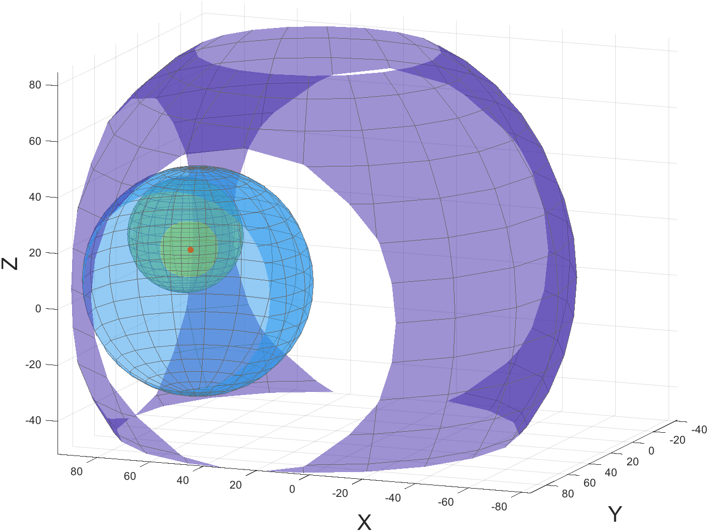

# CTM 2020 Summer Internship

## Flying Communications Node Controller Sensitive to Traffic

### GWP Algorithm

For the first phase of the project, we had to calculate the relay UAV's optimal position through the GWP algorithm.

To solve this problem, we used [GEKKO](https://gekko.readthedocs.io/en/latest/#), a Python package for optimization of algebraic equations.  
It was utilized to solve the system of inequalities correspondent to the intersection of the spheres representing each FAP's wireless range.

|  | 
|:--:| 
| *Representation of each FAP's wireless range (spheres) and the relay UAV position (red point)* |

