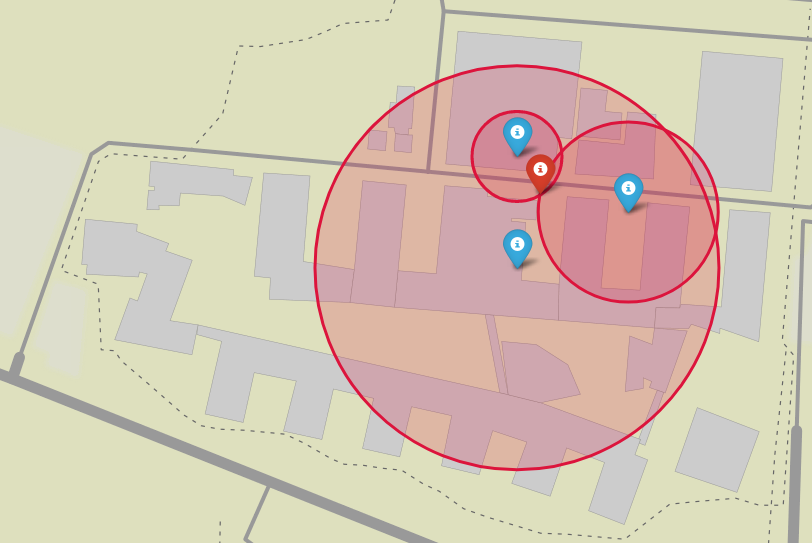

# CTM 2020 Summer Internship

## Flying Communications Node Controller Sensitive to Traffic

### GWP Algorithm

For the first phase of the project, we had to calculate the relay UAV's optimal position through the GWP algorithm.

To solve this problem, we used [GEKKO](https://gekko.readthedocs.io/en/latest/#), a Python package for optimization of algebraic equations.  
It was utilized to solve the system of inequalities correspondent to the intersection of the spheres representing each FAP's wireless range.

|  | 
|:--:| 
| *Representation of each FAP's wireless range (spheres) and the relay UAV position (red point)* |

### Simulation

For the simulation we used the [SITL Simulator](https://ardupilot.org/dev/docs/sitl-simulator-software-in-the-loop.html) alongside [DroneKit's Python API](https://github.com/dronekit/dronekit-python). This allowed us to get an idea of how the drone would behave in a real life situation as well as control it, so it would go to the optimal position given the FAPs location.  


It wasn't possible, however, to represent the FAPs in the simulation easily, so we used [Folium](http://python-visualization.github.io/folium/) Python library that represents the whole scene in a interactive map.



### Instructions

To install **ArduPilot**, open a terminal in the project folder and run:

```sh
git clone https://github.com/ArduPilot/ardupilot
cd ardupilot
git submodule update --init --recursive
```
 
To install pip dependencies open a terminal in the project folder and run:
```sh
pip install -r requirements.txt
```
 
To run the program open a terminal in the project folder and run:
```sh
./run_sitl.sh
```
